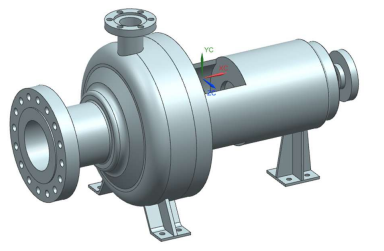
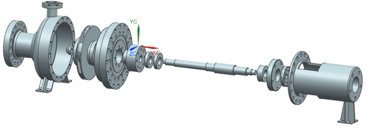
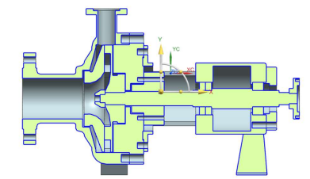
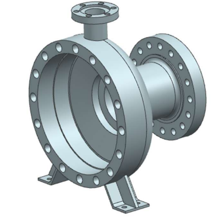
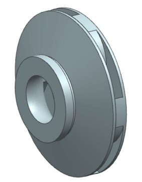
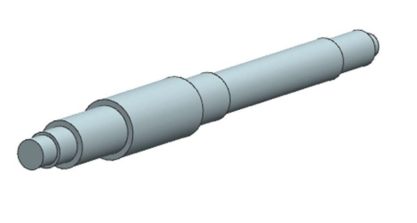
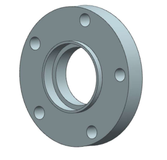
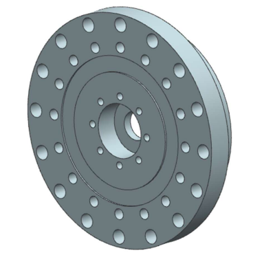

# Centrifugal Pump CAD Project

## Overview
This project involved designing and modeling a fully assembled centrifugal pump in CAD.  
The model includes all major components such as the casing, impeller, shaft, bearing housing, and sealing features.  
The goal was to accurately represent mechanical fit, assembly relationships, and internal flow geometry typical of an end-suction centrifugal pump.

---

## Full Assembly

### Assembled View

### Exploded View

### Section View

---

## Individual Components

### Casing

### Impeller

### Shaft

### Bearing Housing

### Bearing Cover

### End Suction Inlet

---

## Skills Demonstrated
- Parametric part modeling
- Assembly constraints and fits
- Section views and exploded configurations
- Mechanical design for rotating equipment
- Understanding of centrifugal pump architecture

---

## Software Used
*(Add your CAD software here — e.g., SolidWorks, Fusion 360, Inventor, etc.)*
