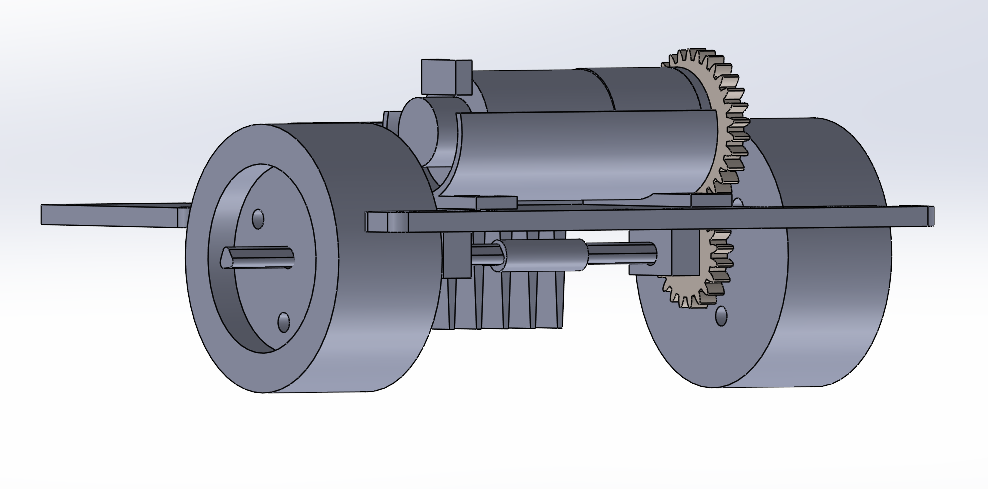

# RC Car CAD

This folder contains the CAD files for the RC car project.

## Files

- `final_assembly.step` – STEP file of the full assembly for universal viewing.
- `images/` – Screenshots of key CAD models:
  - Full assembly
    
  - Drivetrain assembly
    
  - Steering assembly
    
  - Chassis
    
  - Motor mount
    
  - Battery mount
    

## Notes

- CAD models were created in SolidWorks.
- STEP file included for viewing; native SolidWorks files are available upon request.
- Screenshots highlight key subsystems and design decisions.
