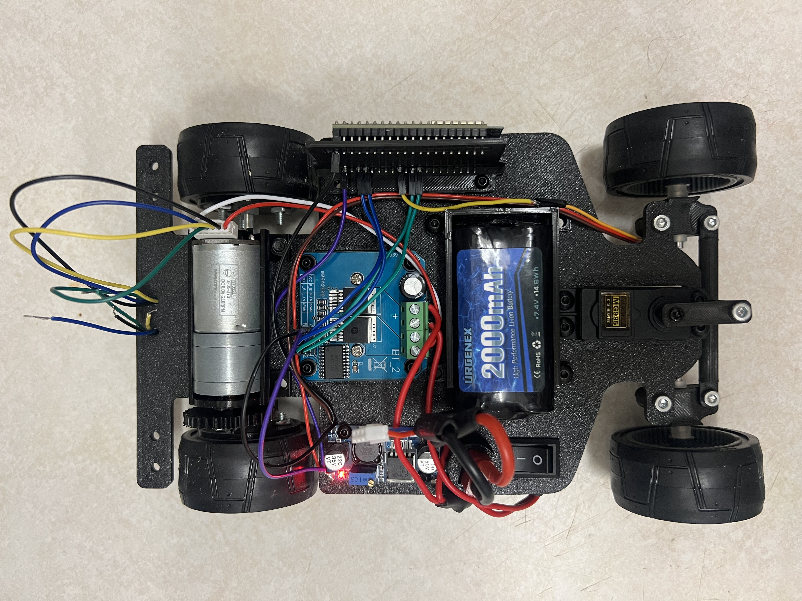
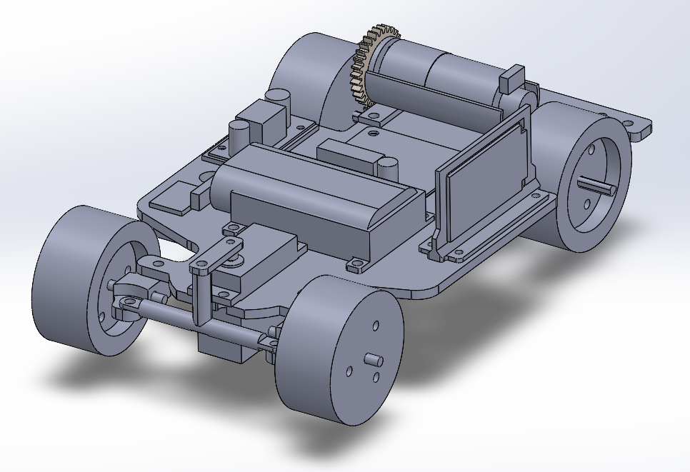
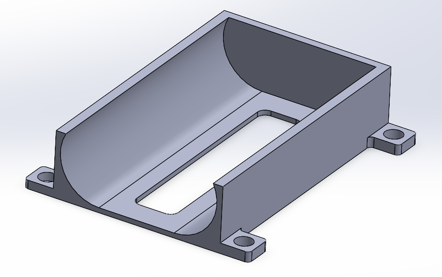
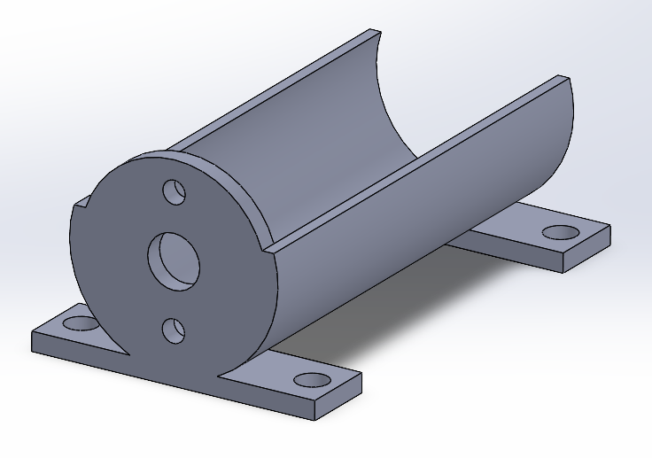
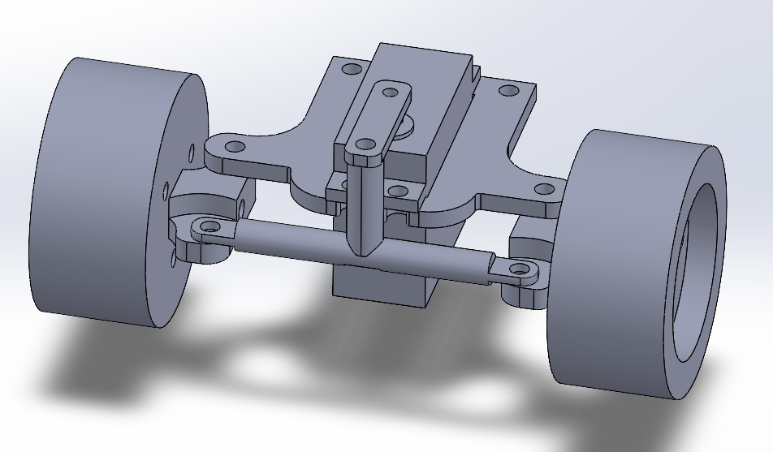
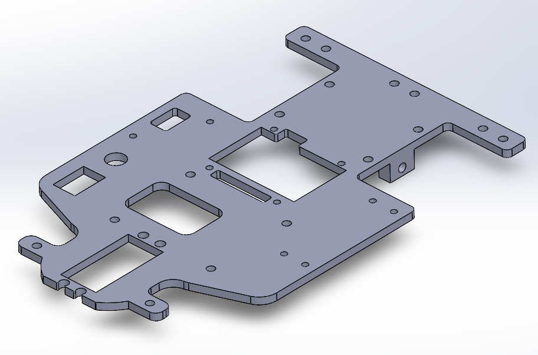
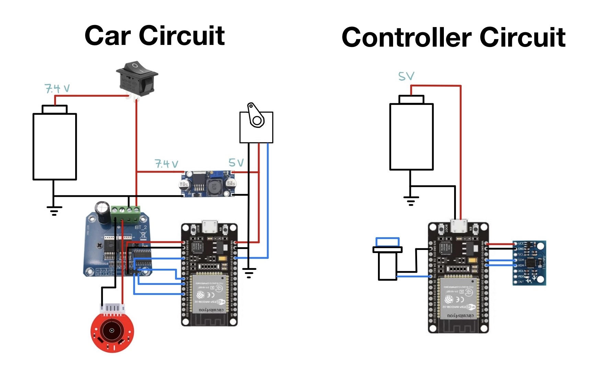

# Motion Controlled RC Car Project

<table>
  <tr>
    <td></td>
    <td></td>
  </tr>
</table>

Fully custom motion-controlled RC car. The controller uses an MPU6050 IMU to steer the car by tilting left/right, and control the throttle by tilting forward/back. Car and controller run on ESP32 microcontrollers and communicate wirelessly via ESP-NOW.

---

**Motion-Control Demo (IMU-based steering & throttle)**

---

### 1. Mechanical
Created a full CAD design of the car assembly. STEP file of the full assembly is available [here](CAD/RCCarAssembly.STEP).

Designed and 3D printed mounts for the battery, driver motor, and ESP32, as well as the steering mechanism linkages and the chassis
<table>
  <tr>
    <td></td>
    <td></td>
  </tr>
</table>
<table>
  <tr>
    <td></td>
    <td></td>
  </tr>
</table>

---

### 2. Electrical
Specced and sourced all componenets, ensuring mechanical and electrical compatibaility.
Electronics were integrated with secure connections using a combination of screw terminals, soldered joints, and JST connectors.

High Level Circuit Diagram for the car and controller:

---

### 3. Software
Car and remote programmed on ESP32 microcontrollers using Arduino IDE.

- Motion-based steering and throttle using an MPU6050 Inertial Measurement Unit  
- Angle calculated using a **complementary filter** combining accelerometer and gyroscope data  
- Steering limited to ±60° for safety, with a dead zone to prevent accidental movement  
- Motion-enabled driving only engages when a dedicated controller button is pressed  
- Communication between car and remote handled via ESP-NOW at a 10 Hz update rate
- PWM control for motor speed and direction

- Code folder contains source files for car and remote
---

### 4. Continuing Work
- Design and 3D print a sleek and ergonmic controller that neatly holds all components
- Utilize the encoder on the motor to implement a PID feedback control algorithm for smoother speed control
- Create a body shell to enhance the car's appearance and protect electronics

